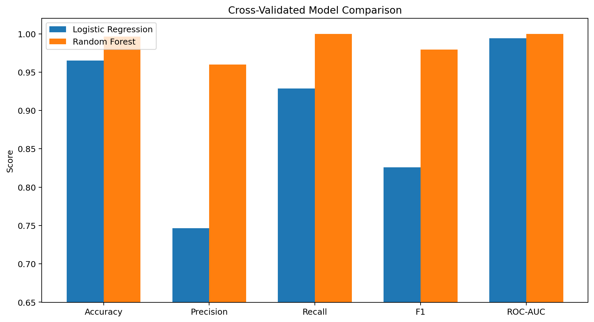
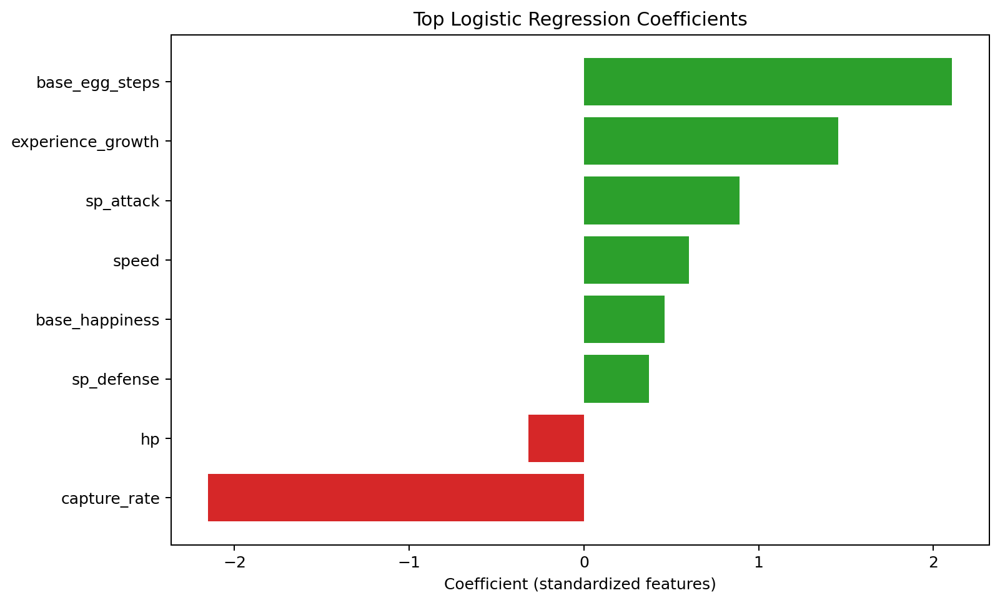
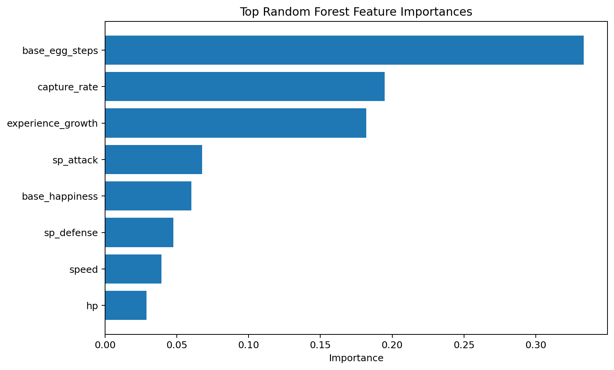

  

<h1 align="center">Legendary Pokémon Classification</h1>

  Predicting whether a Pokémon is legendary using gameplay and stat features.

## Overview

This project started as a fun question I had while looking through a full Pokémon dataset I found online:

**Can you tell whether a Pokémon is legendary just from a small set of numeric gameplay/stat features?**

I trained and compared a couple of classic ML models on a cleaned version of the dataset and ended up with two pretty interesting takeaways:

- even a simple **logistic regression** model performs extremely well
- a **random forest** model is almost perfect on this task and stays that way under cross-validation

Additonally, game-design metadata like **capture rate**, **base egg steps**, and **experience growth** turned out to be some of the strongest signals, which surprised me.

## Dataset

- Source: Kaggle Pokémon dataset scraped from Serebii
- Rows: 801 Pokémon
- Target: `is_legendary`
- Final feature subset used in the main models:
  - `attack`
  - `base_egg_steps`
  - `base_happiness`
  - `capture_rate`
  - `defense`
  - `experience_growth`
  - `hp`
  - `sp_attack`
  - `sp_defense`
  - `speed`
  - `weight_kg`

## What I built

I trained and evaluated:

- **Logistic Regression**
- **Random Forest**

To make the comparison more reliable, I used:

- median imputation for missing numeric values
- feature scaling for logistic regression
- stratified 5-fold cross-validation

## Results

### Cross-validated model performance

| Model | Accuracy | Precision | Recall | F1 | ROC-AUC |
|---|---:|---:|---:|---:|---:|
| Logistic Regression | 0.9651 | 0.7466 | 0.9286 | 0.8260 | 0.9939 |
| Random Forest | **0.9963** | **0.9600** | **1.0000** | **0.9793** | **0.9996** |

  

On a held-out test split, logistic regression reached **98.1% accuracy** and the random forest reached **100% accuracy** (which I was a little skeptical about). I was a little more careful about the random forest result in this writeup, since one perfect split matters less than performance across multiple folds. The cross-validation numbers ended up telling the more useful story anyway.

### Logistic regression coefficients

  

### Random forest feature importances

  

Both models pointed to the same small set of standout predictors:

- **base_egg_steps**
- **capture_rate**
- **experience_growth**

That was probably the most interesting part of the project for me. I didn't know that a niche stat like base egg steps (how long the Pokémon takes to hatch from an egg) would be more informative than something like total health or attack stats.

## Summary / Key takeaways

- A small set of numeric features is enough to separate legendary from non-legendary Pokémon extremely well.
- **Random forest** clearly outperformed a strong logistic regression baseline, which suggests some nonlinear structure in the data.
- The most informative features were tied to **rarity and progression mechanics**, not just battle strength.

